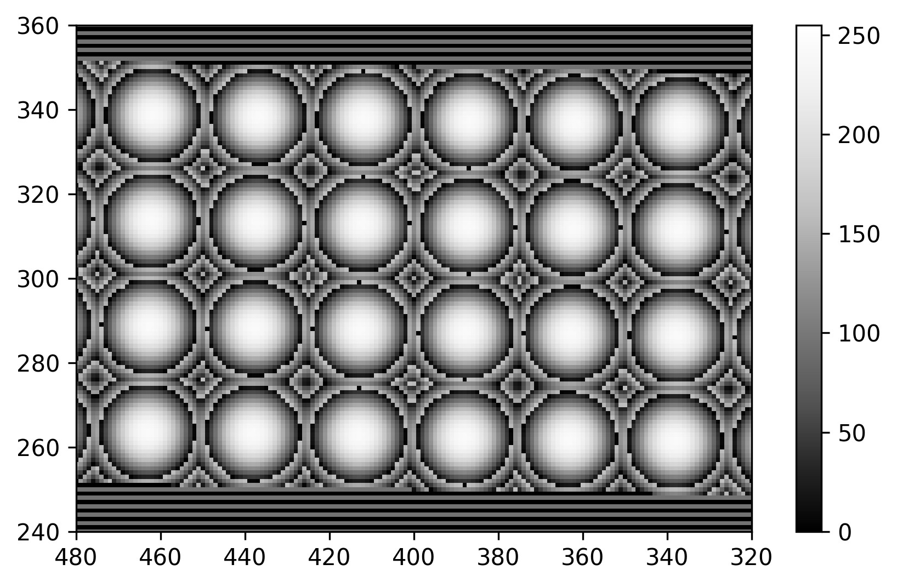

# lcos_multispot_pattern

Create a multispot pattern via phase modulation using a LCOS-SLM.

The repo contains:

- `patternlib.py`: the library for generating the multispot pattern.
- `pattern_server.py`: a script to start a "pattern server" listening for
  pattern parameters and returning 2D arrays containing the pattern.
- `installer.cfg`: configuration for building an NSIS installer for a stand-alone
  installation of `pattern_server.py` using [pynsist](https://github.com/takluyver/pynsist).
  
The other files are just notebooks GUIs for playing around with generating the pattern
and visualizing it using QT5 or jupyter notebook widgets.

# Dependencies

- python 3.5+
- numpy 1.10+
- pyyaml 3.12
